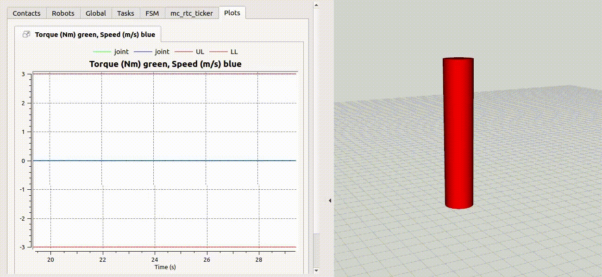

# TorqueLimitTest

Sample controller for testing reaching the torque limit on 1 DoF robot.

## Dependencies

* [`mc_rtc`](https://github.com/jrl-umi3218/mc_rtc)
* [`onedof_description`](https://github.com/anastasiabolotnikova/onedof_description)
* [`mc_onedof`](https://github.com/anastasiabolotnikova/mc_onedof)
